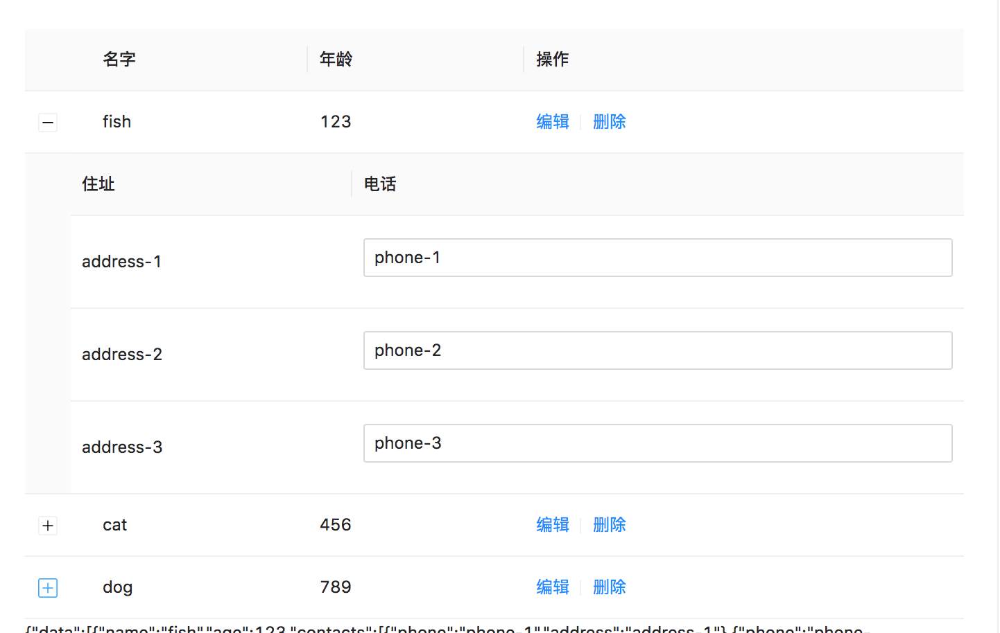
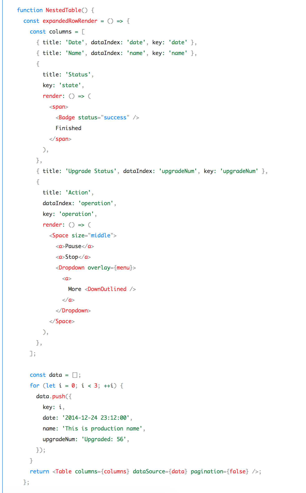
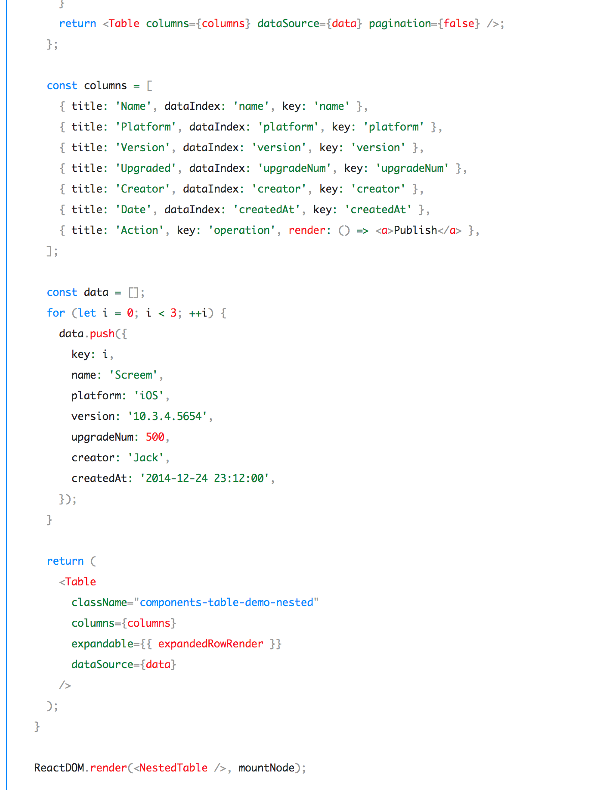
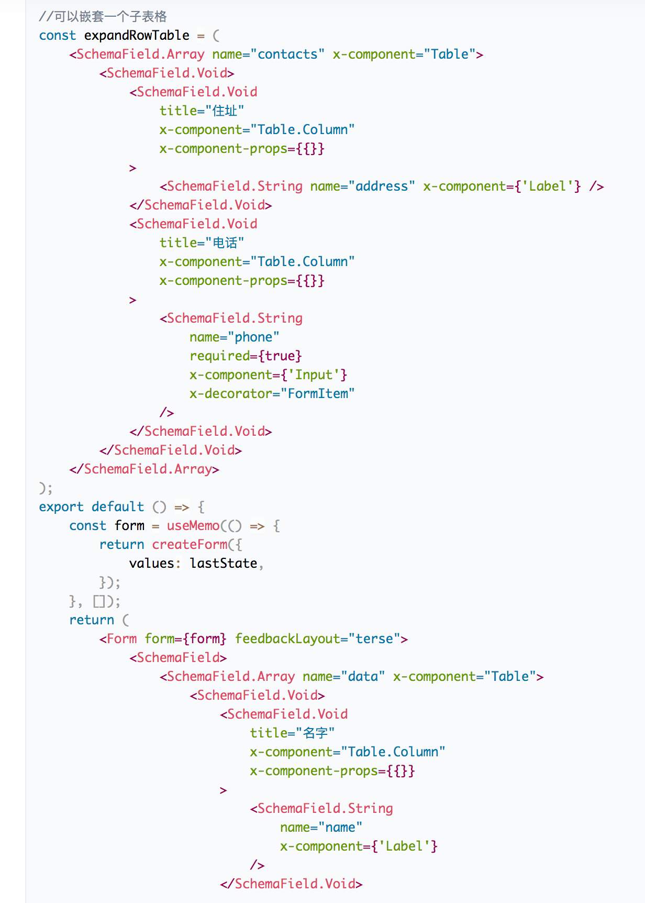
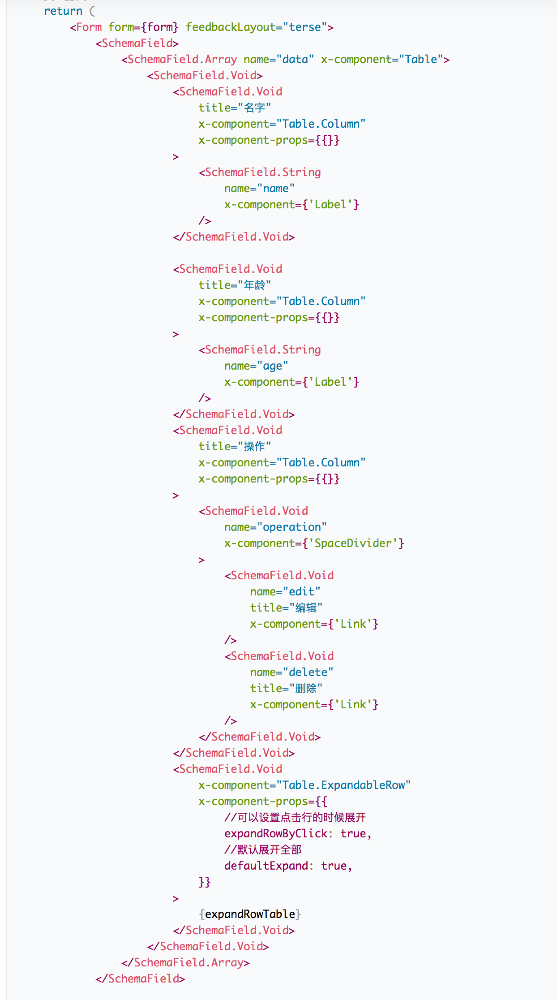
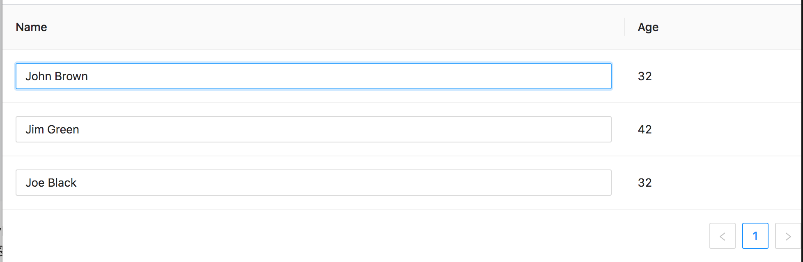
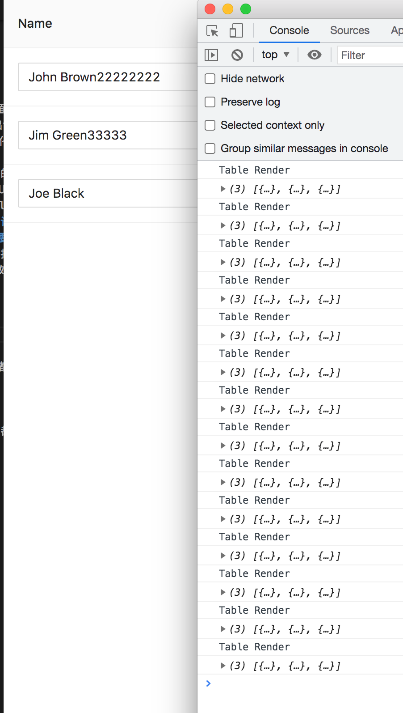
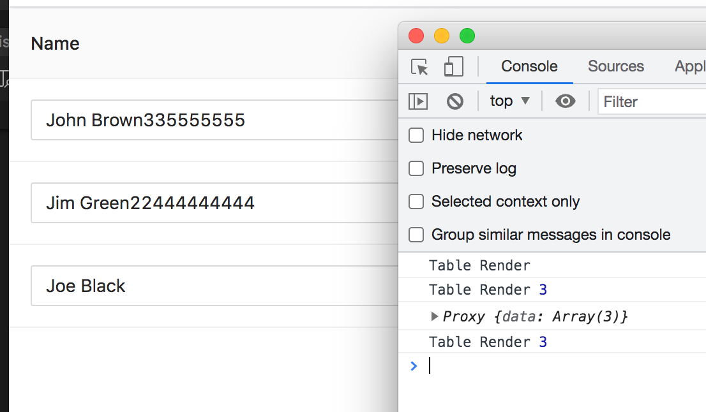
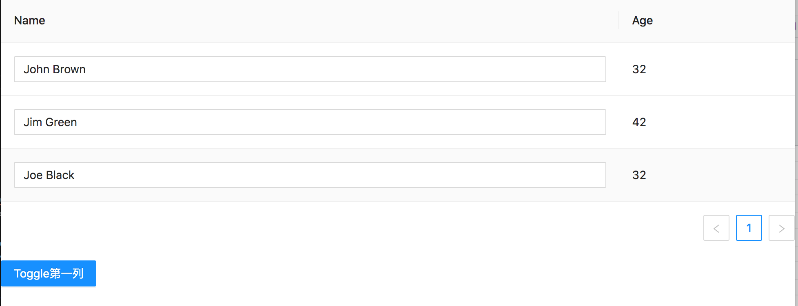
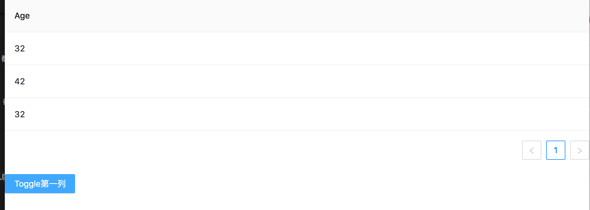

作为后台管理系统的重度开发者，先说结论，我爱死了这个框架了。这个框架可能是未来**后台管理系统**的标配，他真正地刺到了开发者的痛点，不仅是开发效率，还是在性能，代码可读性，逻辑联动，自定义组件等领域都是很非常不错的。

你可能没用过formily，但是我们先不管formily有什么功能，它的原理是什么，我们就先直观来看一下formily的代码长什么样先。

## 类XML开发



假设我们现在要开发一个表格嵌套表格的功能





使用原生的Ant Design Table是需要这样写的，传递Column，以及编写expandable属性。在expandable属性里面传递expandableRowRender的闭包方法，在闭包方法里面传递一个新的Table实例。





Formily的写法是这样的，用一个变量编写JSX代码来描述页面，然后将这个变量嵌套主JSX代码里面就可以了。这个过程没有if，没有for，没有map，没有闭包，没有三元表达式，就是一个类XML就能是实现这个功能了。

我感觉是这种Schema的设计是相当优美的，而且从代码中就能看出UI界面上的这种嵌套关系，更为直观与漂亮。

## Schema与Data分离



然后，下一步的，我们要实现大概这样的功能，第一个列的数据是Input的组件

```tsx
import { Table, Tag, Space ,Input} from 'antd';
import { useState } from 'react';

export default ()=>{
   let [data,setData] = useState([
      {
        key: '1',
        name: 'John Brown',
        age: 32,
      },
      {
        key: '2',
        name: 'Jim Green',
        age: 42,
      },
      {
        key: '3',
        name: 'Joe Black',
        age: 32,
      },
    ]); 
    const columns = [
      {
        title: 'Name',
        dataIndex: 'name',
        key: 'name',
        render: (text,record,index) => {
          const onChange = (newValue)=>{
              let newData = data.map((value,oldIndex)=>{
                if(oldIndex != index){
                  return value;
                }
                return {
                    ...value,
                    name:newValue.target.value,
                  }
              });
              setData(newData);
          }
          return (<Input value={text} onChange={onChange}/>);
        }
      },
      {
        title: 'Age',
        dataIndex: 'age',
        key: 'age',
      },
    ];
    console.log('Table Render');
    console.log(data);
    return <Table columns={columns} dataSource={data} />;
};
```

使用原生的Ant Design Table是需要这样写的，在每一列的render里面重写方法，返回自定义的组件。而且，数据是传递了2次的，首次是传入Table组件里面的dataSource，第二次是在render里面取出text，然后用这个text的数据来渲染Input组件的数据。

而且，我们还要小心地处理Input以后的onChange方法，新构造的数据要原数据是不同引用的，要用map，而不是原地修改数据。我们能在控制台看到每次Input变化的时候，产生的控制台输出。

这种做法很常见，我们一直都是这样写的。**当UI组件从根部到底部逐渐细分的时候，data也要伴随着一起不断细分**。

```tsx
import { createForm } from '@formily/core';
import { createSchemaField, FormConsumer } from '@formily/react';
import {  Table } from 'antd-formily-boost';
import { Form, Input } from '@formily/antd';
import React, { useMemo } from 'react';
import { observable } from '@formily/reactive';

const SchemaField = createSchemaField({
    components: {
        Input,
        Table,
    },
});

let lastState = observable({
  data: [
    {
      key: '1',
      name: 'John Brown',
      age: 32,
    },
    {
      key: '2',
      name: 'Jim Green',
      age: 42,
    },
    {
      key: '3',
      name: 'Joe Black',
      age: 32,
    },
  ]
});

export default () => {
    console.log('Table Render');
    const form = useMemo(() => {
        return createForm({
            values: lastState,
        });
    }, []);
    return (
        <Form form={form} feedbackLayout="terse">
            <SchemaField>
                <SchemaField.Array
                    name="data"
                    x-component="Table"
                    x-component-props={{
                        //加上边框
                        bordered: true,
                    }}
                >
                    <SchemaField.Void>
                        <SchemaField.Void
                            title="Name"
                            x-component="Table.Column"
                            x-component-props={{}}
                        >
                            <SchemaField.String
                                name="name"
                                x-component={'Input'}
                            />
                        </SchemaField.Void>

                        <SchemaField.Void
                            title="Age"
                            x-component="Table.Column"
                            x-component-props={{
                              labelIndex:'age'
                            }}
                        />
                    </SchemaField.Void>
                </SchemaField.Array>
            </SchemaField>
            <FormConsumer>
                {() => {
                  console.log(form.values)
                  return <span/>;
                }}
            </FormConsumer>
        </Form>
    );
};
```

等效的Formily是这样的，在Column里面嵌套一个Input组件就可以了，这个组件只需要标注name属性，不需要取出text数据再传递Input组件这样的操作。我们能在控制台看到每次Input变化的时候，产生的控制台输出。

Formily的代码都是如此，只需要在顶头的Form组件里面传入form写入data数据以后。Schema里面就只需要写UI代码就可以了。实际传递到每个Input组件的value是什么，是由Formily根据Schema自动计算出来，然后再到传递到Input组件里面。**这种自动计算是支持多层嵌套的，就像在上一个例子中，表格嵌套表格，我们也没有需要拿出某一行的data来渲染子表格的操作**，这大大降低了开发者的心智负担，基本只需要写UI组件，代码就会自动跑起来。而且，开发者也不再需要处理onChange，value这些组件的属性，仅仅专注于业务就可以了。

换句话说，UI的Schema不断细分的过程中，data自身是能够自动不断细分的，不需要开发者去显式指定这个过程。

## 高性能



拿刚才的例子来说，每一行数据的修改，都会触发整个表格的变动。



而Formily的例子，每一行数据的修改，都仅仅是触发Input组件自身的重渲染，Table组件不需要重新render。

## 逻辑联动



接下来我们要实现这个页面，点击按钮以后，第一列可以消失，或者显式



这样就消失第一列了

```tsx
import { Table, Tag, Space ,Input,Button} from 'antd';
import { useState } from 'react';

export default ()=>{
    let [isShowFirstColumn,setSetFirstColumn] = useState(true);
   let [data,setData] = useState([
      {
        key: '1',
        name: 'John Brown',
        age: 32,
      },
      {
        key: '2',
        name: 'Jim Green',
        age: 42,
      },
      {
        key: '3',
        name: 'Joe Black',
        age: 32,
      },
    ]); 
    let columns = [
      {
        title: 'Name',
        dataIndex: 'name',
        key: 'name',
        render: (text,record,index) => {
          const onChange = (newValue)=>{
              let newData = data.map((value,oldIndex)=>{
                if(oldIndex != index){
                  return value;
                }
                return {
                    ...value,
                    name:newValue.target.value,
                  }
              });
              setData(newData);
          }
          return (<Input value={text} onChange={onChange}/>);
        }
      },
      {
        title: 'Age',
        dataIndex: 'age',
        key: 'age',
      },
    ];
    if( isShowFirstColumn == false){
        columns = columns.slice(1);
    }
    console.log('Table Render');
    console.log(data);
    const onClick = ()=>{
        setSetFirstColumn(!isShowFirstColumn);
    }
    return (
    <Space direction="vertical" style={{display:'flex'}}>
        <Table columns={columns} dataSource={data} />
        <Button type="primary" onClick={onClick}>Toggle第一列</Button>
    </Space>
    );
};
```

建立一个新的state，然后用这个state来控制columns的大小，这种也是常见做法了。但是，当业务需要根据数据显隐多个不同列的时候，这种方法就会麻烦起来。

```tsx
import { createForm } from '@formily/core';
import { createSchemaField, FormConsumer } from '@formily/react';
import {  Table } from 'antd-formily-boost';
import { Form, Input ,Space} from '@formily/antd';
import React, { useMemo } from 'react';
import { observable } from '@formily/reactive';
import {Button} from 'antd';

const SchemaField = createSchemaField({
    components: {
        Input,
        Table,
    },
});

let lastState = observable({
  data: [
    {
      key: '1',
      name: 'John Brown',
      age: 32,
    },
    {
      key: '2',
      name: 'Jim Green',
      age: 42,
    },
    {
      key: '3',
      name: 'Joe Black',
      age: 32,
    },
  ]
});

export default () => {
    console.log('Table Render');
    const form = useMemo(() => {
        return createForm({
            values: lastState,
        });
    }, []);
    const onClick = () => {
        const columnField = form.query('data.firstColumn').take();
        if (!columnField) {
            return;
        }
        columnField.visible = !columnField.visible;
    };
    return (
    <Space direction="vertical" size={10} style={{ display: 'flex' }}>
        <Form form={form} feedbackLayout="terse">
            <SchemaField>
                <SchemaField.Array
                    name="data"
                    x-component="Table"
                    x-component-props={{
                        //加上边框
                        bordered: true,
                    }}
                >
                    <SchemaField.Void>
                        <SchemaField.Void
                            name="firstColumn"
                            title="Name"
                            x-component="Table.Column"
                            x-component-props={{}}
                        >
                            <SchemaField.String
                                name="name"
                                x-component={'Input'}
                            />
                        </SchemaField.Void>

                        <SchemaField.Void
                            title="Age"
                            x-component="Table.Column"
                            x-component-props={{
                              labelIndex:'age'
                            }}
                        />
                    </SchemaField.Void>
                </SchemaField.Array>
            </SchemaField>
            
            <FormConsumer>
                {() => {
                  console.log(form.values)
                  return <span/>;
                }}
            </FormConsumer>
        </Form>
        <Space direction={'horizontal'}>
            <Button onClick={onClick} type="primary">
                Toggle第一列
            </Button>
        </Space>
    </Space>
    );
};
```

Formily的做法是使用Path表达式获取组件，然后直接设置组件属性就可以了，更为简单直观。当业务需要根据数据显隐多个不同列的时候，也能轻松处理。

## 自定义组件

这么复杂的Formily机制，那么，我们要将Input组件替换为自己的组件，会很麻烦吗？不会，就像你自定义React组件一样简单。

```tsx
import { createForm } from '@formily/core';
import { createSchemaField, FormConsumer } from '@formily/react';
import {  Table } from 'antd-formily-boost';
import { Form, Input } from '@formily/antd';
import React, { useMemo } from 'react';
import { observable } from '@formily/reactive';

type MyInputType = {
    value: string;
    onChange: (data: any) => void;
};

const MyInput = (props: MyInputType) => {
    return (
        <input
            style={{
                color: 'red',
                background: 'none',
                outline: 'none',
                width: '100%',
                border: '1px solid grey',
            }}
            value={props.value}
            onChange={props.onChange}
        />
    );
};


const SchemaField = createSchemaField({
    components: {
        MyInput,
        Table,
    },
});

let lastState = observable({
  data: [
    {
      key: '1',
      name: 'John Brown',
      age: 32,
    },
    {
      key: '2',
      name: 'Jim Green',
      age: 42,
    },
    {
      key: '3',
      name: 'Joe Black',
      age: 32,
    },
  ]
});

export default () => {
    console.log('Table Render');
    const form = useMemo(() => {
        return createForm({
            values: lastState,
        });
    }, []);
    return (
        <Form form={form} feedbackLayout="terse">
            <SchemaField>
                <SchemaField.Array
                    name="data"
                    x-component="Table"
                    x-component-props={{
                        //加上边框
                        bordered: true,
                    }}
                >
                    <SchemaField.Void>
                        <SchemaField.Void
                            title="Name"
                            x-component="Table.Column"
                            x-component-props={{}}
                        >
                            <SchemaField.String
                                name="name"
                                x-component={'MyInput'}
                            />
                        </SchemaField.Void>

                        <SchemaField.Void
                            title="Age"
                            x-component="Table.Column"
                            x-component-props={{
                              labelIndex:'age'
                            }}
                        />
                    </SchemaField.Void>
                </SchemaField.Array>
            </SchemaField>
            <FormConsumer>
                {() => {
                  console.log(form.values)
                  return <span/>;
                }}
            </FormConsumer>
        </Form>
    );
};
```

自定义一个MyInput组件，然后替换掉SchemaField的Input就可以了。

## 总结

Formily还有自己的[可视化编辑器](https://designable-antd.formilyjs.org/)，还有更复杂的数据联动支持，还有JSON Schema，这真的是一个宝藏项目，值得大家试一试


